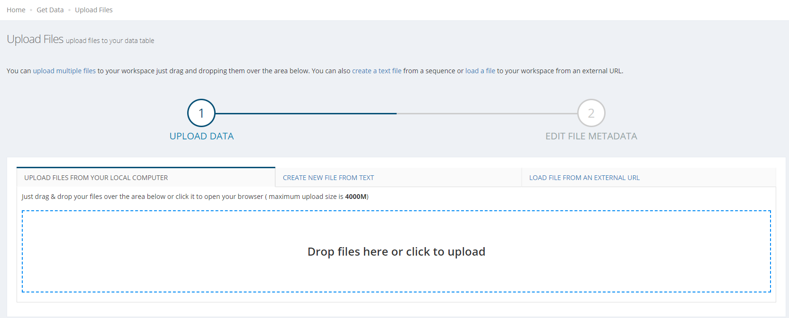

Evaluate your agent
------------------
If you want to evalute your agent using one of the open benchmarking events in OpenEBench, these are the steps you need to follow:

1.	First step is to make sure your agent is added in [bio.agents](https://bio.agents/) or [bioconda](https://anaconda.org/bioconda) or [Galaxy Agent-Shed](https://agentshed.g2.bx.psu.edu/). These three repositories are the sources of information about the agents in OpenEBench.
2.	Then, you need to run your agent using the specific parameters you want to evaluate and get the corresponding **predictions** that will be used for the benchmarking. This is the data that will be used as input for the benchmarking worflows.
3.	The predictions that you previously obtained, will be evaluated with the **benchmarking workflows** already made avaiable in the [Virutal Research Environment](https://openebench.bsc.es/vre//workspace/) platform, in order to evalaute the performance of your agent. To do that, you need to upload to the platform the results of the agent interested in evaluating that you generated in the pervious step.

4.	Then, select the relevant benchmarking event and “run it”. Internally, the corresponding benchmarking workflow will compute the metrics qualifying the given data in a on-permisses cloud infrastructure.

5.	Eventually, a graphic visualization is offered to comparatively analyse the obtained metrics with other participating method metrics.

6.	If results are satisfactory, a member of the OpenEBench team will be able to **publish your results** in the web server where they are going to be visualized.
